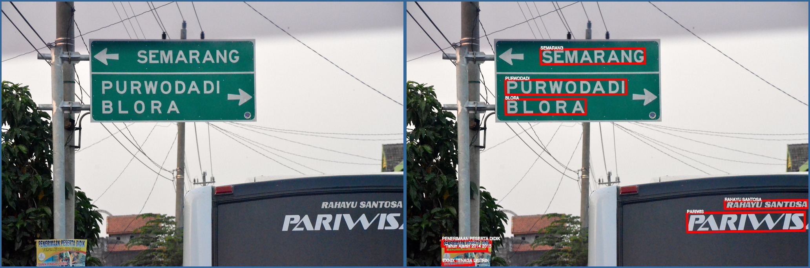
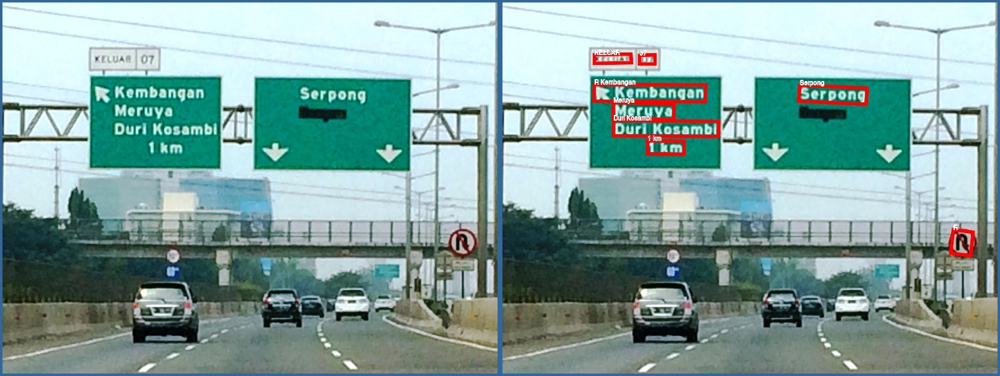

Use Case: Reading Street Signs
==============================

Here we demonstrate one specific capability of Azure Computer Vision
cognitive service, extracting text from photos, as exposed through the
[MLHub](https://mlhub.ai) package 
[azcv](https://github.com/Azure/azcv).

Extracting text from photos is crucial in the context of autonomous
vehicles where seeing and understanding street signs plays an
increasingly important role. The challenge for this task is to not
only extract text from the image, but to identify the text that was on
a street sign as distinct from that which might be visible on a bus or
advertising sign across different locations within the photo, or the
names of buildings or the names of businesses in those buildings. In
the examples below we do not yet consider the task of the context of
the text so extracted. This is a crucial post-processing task,
involving further image processing (object detection), spatial
reasoning, and semantic analysis.

As a command line pipeline tool the opportunity is thus to use the
expertise of the ocr tool to extract the text, combined with
processing by other specialist tools to capture, for example, the
background colour and location of the text in relation to other
objects in the photo. Stay tuned for further examples.


```console
$ ml ocr azcv https://sharpie51.files.wordpress.com/2010/02/street_sign_for_abbey_road_in_westminster_london_england_img_1461.jpg
325.0 305.0 1297.0 290.0 1302.0 594.0 329.0 609.0,ABBEY
311.0 664.0 1937.0 652.0 1940.0 943.0 314.0 955.0,ROAD NW8
343.0 1142.0 1784.0 1121.0 1786.0 1253.0 345.0 1273.0,CITY OF WESTMINSTER
```
Here we identify the actual location of the text and annotate the
image with the bounding box and the identified text.

```console
$ wget -O img.jpg https://sharpie51.files.wordpress.com/2010/02/street_sign_for_abbey_road_in_westminster_london_england_img_1461.jpg
$ ml ocr azcv img.jpg > img_bb.txt

# Add bounding boxes to the image.

$ cat img_bb.txt |
  cut -d',' -f1 |
  xargs printf '-draw "polygon %s,%s %s,%s %s,%s %s,%s" ' |
  awk '{print "img.jpg -fill none -stroke red -strokewidth 5 " $0 "img_bb.jpg"}' |
  xargs convert

# Add the identified text to the image.

$ cat img_bb.txt |
  tr ',' ' '| 
  cut -d' ' -f1,2,9- | 
  perl -pe 's|([\d\.]+) ([\d\.]+) (.+)|-annotate +\1+\2 \\"\3\\"|' | 
  xargs | 
  awk '{print "img_bb.jpg -pointsize 50 " $0 " img_bb_text.jpg"}' | 
  xargs convert

# Create a montage of the original and final image.

$ montage -background '#336699' -geometry +4+4 img.jpg img_bb_text.jpg montage.jpg

# Display the image.

$ eog montage.jpg
```


Below are some further street sign text (and other text) extracted
from photos. 

With this first one an extra challenge beyond the example here is to
identify the direction indications of the sign, so that we know which
way to turn, based on the street sign itself to confirm, perhaps, what
our map is telling us. 

As we begin to augment the skill of reading text and identifying
objects within a photo, with understanding the spatial relationship
between the text and objects in the photo, and then using heuristics
to understand the sign, we begin to demonstrate intelligence beyond
vision.

In the first instance, transfer learning can be used to distinguish
the street sign, and to then identify the directions.


```console
$ ml ocr azcv https://farm4.staticflickr.com/3883/15144849957_f326e03f75_b.jpg
341.0 122.0 606.0 120.0 607.0 158.0 342.0 160.0,SEMARANG
251.0 200.0 559.0 199.0 560.0 237.0 252.0 238.0,PURWODADI
251.0 250.0 456.0 249.0 456.0 288.0 252.0 289.0,BLORA
810.0 510.0 1022.0 508.0 1023.0 528.0 811.0 530.0,RAHAYU SANTOSA
714.0 541.0 1014.0 538.0 1014.0 586.0 715.0 590.0,PARIWIS
90.0 610.0 213.0 609.0 214.0 626.0 91.0 627.0,PENERIMAAN PESERTA DIDIK
99.0 629.0 204.0 627.0 205.0 638.0 99.0 640.0,Tahun Ajaran 2014 2015
91.0 666.0 170.0 662.0 171.0 673.0 92.0 678.0,EXNIX TENAGA LISTRIN
```
Creating a montage using the above commands as a script, modified to
include -stroke white -pointsize 10:


*Observations:* Even the advertising on the street pole is clearly identified.


```console
$ ml ocr azcv http://brombeer.net/signs/id_approach.jpg
148.0 84.0 207.0 83.0 208.0 97.0 148.0 98.0,KELUAR
221.0 85.0 246.0 84.0 246.0 99.0 221.0 99.0,07
148.0 132.0 328.0 133.0 327.0 160.0 147.0 159.0,R Kembangan
480.0 133.0 589.0 138.0 587.0 164.0 478.0 159.0,Serpong
179.0 161.0 277.0 164.0 276.0 189.0 178.0 186.0,Meruya
179.0 190.0 349.0 192.0 348.0 216.0 179.0 215.0,Duri Kosambi
234.0 223.0 293.0 224.0 293.0 245.0 234.0 244.0,1 km
728.0 367.0 760.0 371.0 756.0 409.0 724.0 405.0,R
```
Creating a montage using the above commands as a script, modified to
include -stroke white -pointsize 10:


*Observations:* One arrow is picked up as R as is the No U Turn sign.


```console
$ ml ocr azcv https://upload.wikimedia.org/wikipedia/commons/7/7e/Indonesian_Road_Sign_-_NR_Directional.png
351.0 90.0 1272.0 87.0 1273.0 202.0 352.0 204.0,Purwokerto
102.0 348.0 209.0 347.0 209.0 367.0 103.0 369.0,NASIONAL
354.0 397.0 1273.0 382.0 1275.0 497.0 356.0 512.0,Yogyakarta
353.0 644.0 1056.0 656.0 1054.0 761.0 351.0 748.0,Kebumen
1331.0 703.0 1436.0 703.0 1436.0 723.0 1332.0 724.0,NASIONAL
356.0 802.0 1088.0 811.0 1086.0 946.0 354.0 937.0,Magelang
1340.0 747.0 1404.0 745.0 1410.0 832.0 1346.0 834.0,3
```

*Observations:* The "NASIONAL 3" logo appears twice yet for one of them
NASIONAL is picked up and for the other 3 is picked up.

