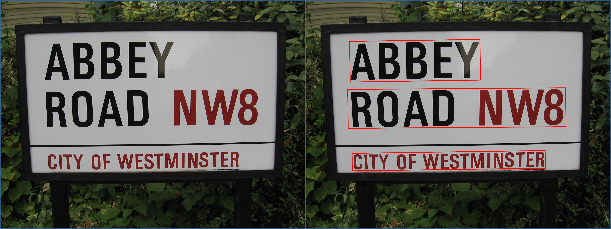

Example Workflows Using azcv
============================

Examples of embedding the azcv commands within a Unix/Linux pipeline.


*How Many Tags Identified in an Image*

```console
$ ml tag azcv img.jpg | wc -l
6
```
*How Many High Confidence Tags Identified*

```console
$ ml tag azcv img.jpg | awk '$1 > 0.90 {print}' | wc -l
5
```

*Identify Tags from a Folder of Images*

```console
$ for f in *.jpg; do echo ==== $f ====; ml tag azcv $f; done
==== 20190610_133243.jpg ====
1.00 indoor
0.99 furniture
0.95 bathroom
0.90 design
0.75 sink
0.61 drawer
0.60 home appliance
==== 20190610_143537.jpg ====
0.94 screenshot
0.92 book
0.91 poster
0.88 indoor
0.63 art
0.59 mobile phone
[...]
```

*Mark up Bounding Boxes for Text in Image*

In this example the bounding boxes are captured into the text
file and then drawn on to a copy of the image.

```console
$ ml ocr azcv img.jpg > img_bb.txt

$ cat img_bb.txt |
  cut -d']' -f1 |
  tr -d '[,' |
  xargs printf '-draw "polygon %s,%s %s,%s %s,%s %s,%s" ' |
  awk '{print "img.jpg -fill none -stroke red " $0 "img_bb.jpg"}' |
  xargs convert
  
$ montage -background '#336699' -geometry +4+4 img.jpg img_bb.jpg montage.jpg

$ eog montage.jpg
```

Here's the result for the Abbey Road sign post:



*Add Text to the Image*

Starting with the bounding box marked up image, we can add the
identified text to each box.

```console
$ cat img_bb.txt |
  tr -d '[],' | 
  cut -d' ' -f1,2,9- | 
  perl -pe 's|(\d+) (\d+) (.+)|-annotate +\1+\2 \\"\3\\"|' | 
  xargs | 
  awk '{print "img_bb.jpg -pointsize 50 " $0 " img_bb_text.jpg"}' | 
  xargs convert

$ montage -background '#336699' -geometry +4+4 img.jpg img_bb_text.jpg montage.jpg

$ eog montage.jpg
```


