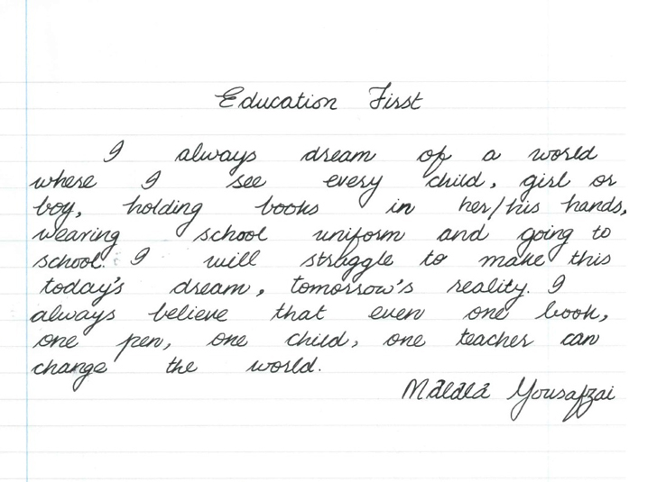

Reading Handwritten Text
========================

Here we demonstrate one specific capability of Azure Computer Vision
cognitive service, extracting text from an image of handwritten text,
as exposed through the [MLHub](https://mlhub.ai) package
[azcv](https://github.com/gjwgit/azcv).

Here are a few examples of handwriting extraction.


This image contains sample hand writing from two gifted 9 year old
year 4 students and users of mlhub: Ryley Nolan and Grace
Patterson. (Used and accredited with permission.)

``` console
 ml ocr azcv https://github.com/gjwgit/azcv/raw/master/images/mycat.png

51.0 43.0 666.0 51.0 665.0 84.0 51.0 76.0,My cats name is freckles . She like's to climb up
39.0 94.0 691.0 104.0 690.0 137.0 38.0 127.0,high. She is 2 years old. She likes to play a lot of games.
37.0 146.0 676.0 155.0 675.0 188.0 36.0 180.0,She likes to sleep on my bed sometimes, She wakes me
25.0 203.0 680.0 204.0 680.0 238.0 24.0 236.0,up in the morning for food. Our cat runs away from my
39.0 251.0 542.0 254.0 541.0 291.0 38.0 287.0,little brother , I love my cat freckels,
19.0 346.0 444.0 358.0 443.0 389.0 18.0 377.0,My Cats name is Mr Tiger!
21.0 404.0 495.0 419.0 494.0 451.0 20.0 436.0,He is fluffy and is fun to play with
15.0 468.0 586.0 479.0 585.0 508.0 14.0 498.0,My cat knows his way around our house
16.0 535.0 726.0 546.0 725.0 574.0 15.0 562.0,My cat can be silly and really smart when he brings Rodents to our house .
13.0 593.0 688.0 608.0 687.0 637.0 12.0 622.0,II love my cat and wouldn't change a thing about him !
```

If you are not interested in the bounding boxes:

``` console
$ ml ocr azcv https://github.com/gjwgit/azcv/raw/master/images/mycat.png | cut -d, -f2-

My cats name is freckles . She like's to climb up
high. She is 2 years old. She likes to play a lot of games.
She likes to sleep on my bed sometimes, She wakes me
up in the morning for food. Our cat runs away from my
little brother , I love my cat freckels,
My Cats name is Mr Tiger!
He is fluffy and is fun to play with
My cat knows his way around our house
My cat can be silly and really smart when he brings Rodents to our house .
II love my cat and wouldn't change a thing about him !
```




``` console
$ ml ocr azcv http://www.handwrittenocr.com/images/Handwriting/16.jpg

237.0 91.0 469.0 92.0 468.0 124.0 236.0 123.0,Education First
188.0 157.0 287.0 158.0 286.0 184.0 187.0 183.0,always
290.0 156.0 424.0 159.0 423.0 184.0 289.0 181.0,dream
426.0 159.0 661.0 154.0 662.0 179.0 427.0 184.0,of a world
32.0 187.0 110.0 189.0 109.0 213.0 31.0 211.0,where
250.0 188.0 293.0 188.0 293.0 209.0 250.0 211.0,see
352.0 185.0 434.0 188.0 433.0 216.0 351.0 213.0,every
458.0 185.0 682.0 184.0 683.0 210.0 459.0 211.0,child , girl or
39.0 216.0 100.0 217.0 99.0 244.0 39.0 242.0,boy,
103.0 214.0 226.0 217.0 226.0 244.0 102.0 240.0,holding
279.0 216.0 356.0 217.0 355.0 240.0 278.0 239.0,books
393.0 213.0 695.0 214.0 694.0 239.0 393.0 239.0,in her/his hands,
37.0 244.0 136.0 246.0 135.0 274.0 36.0 271.0,wearing
204.0 247.0 298.0 248.0 297.0 270.0 203.0 269.0,school
305.0 245.0 675.0 243.0 676.0 271.0 306.0 272.0,uniform and going to
33.0 277.0 169.0 271.0 171.0 296.0 34.0 301.0,School : g
221.0 276.0 295.0 274.0 296.0 297.0 222.0 299.0,will
301.0 274.0 676.0 272.0 677.0 297.0 302.0 299.0,struggle to make this
41.0 304.0 631.0 302.0 632.0 329.0 42.0 331.0,today's dream , tomorrow's reality. 9
31.0 334.0 260.0 333.0 261.0 359.0 32.0 360.0,always believe
269.0 333.0 673.0 332.0 674.0 358.0 270.0 359.0,that even one look ,
35.0 365.0 666.0 362.0 667.0 387.0 36.0 390.0,one pen , one child , one teacher can
33.0 395.0 122.0 394.0 123.0 417.0 34.0 418.0,change
180.0 394.0 223.0 394.0 222.0 417.0 180.0 416.0,the
224.0 390.0 359.0 391.0 358.0 418.0 223.0 416.0,world .
443.0 416.0 682.0 422.0 681.0 450.0 442.0 444.0,malala yousafzai
```
