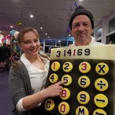
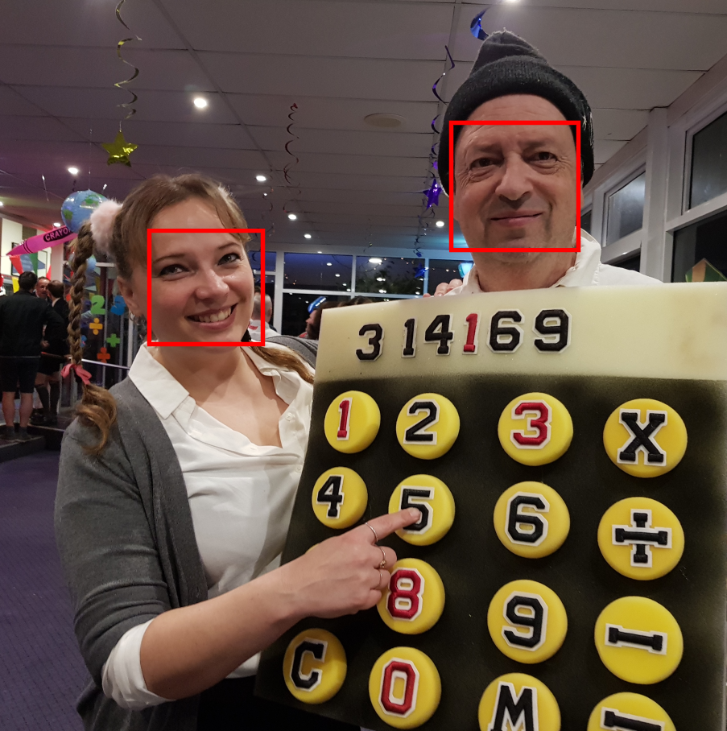
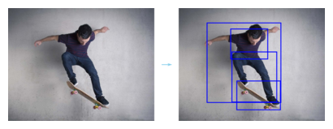
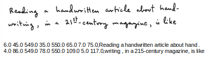
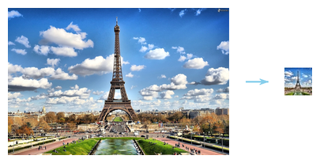
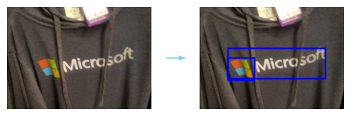
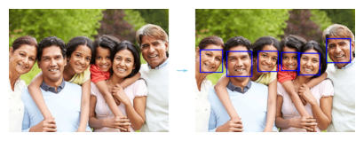
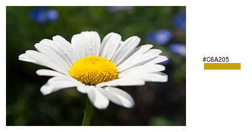
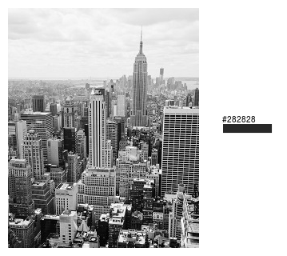
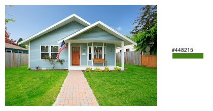

Azure Computer Vision
=====================

This documentation is also published at 
[Read The Docs](https://mlhub-azcv.readthedocs.io/en/latest/).

This [MLHub](https://mlhub.ai) package provides a demonstration, a
graphical user interface, and command line tools that utilise
pre-built models from [Azure Computer
Vision](https://docs.microsoft.com/en-us/azure/cognitive-services/Computer-vision). Individual
command line tools are packaged for common computer vision tasks
including image analysis to extract descriptions of the images, word
recognition from images, landmark identification, thumbnail
generation, and more. The command line tools can be used within
command pipelines for tasks including the tagging of personal photos
folder, analysis of images from a cameras monitoring a bird feeder,
reading street signs to support a driver, and reading handwritten
texts.

A free Azure subscription allowing up to 5,000 transactions per month
with a maximum of 20 per minute (according to [Azure
Pricing](https://azure.microsoft.com/en-gb/pricing/details/cognitive-services/computer-vision/))
is available from <https://azure.microsoft.com/free/>. After
subscribing visit <https://portal.azure.com> and Create a resource
under AI and Machine Learning called Cognitive Services. Once created
you can access the web API subscription key and endpoint from the
portal. This will be prompted for when running a command, and then
saved to file to reduce the need for repeated authentication requests.

Please note that these Azure models, unlike the MLHub models in
general, use *closed source services* which have no guarantee of
ongoing availability and do not come with the freedom to modify and
share.

Visit the github repository for more details:
<https://github.com/gjwgit/azcv>

The Python code is based on the [Computer Vision client library for
Python Quickstart](https://docs.microsoft.com/en-us/azure/cognitive-services/Computer-vision/quickstarts-sdk/python-sdk)
Quick Start guide.

Quick Start Command Line Examples
---------------------------------

```console
ml category azcv https://raw.githubusercontent.com/Azure-Samples/cognitive-services-sample-data-files/master/ComputerVision/Images/landmark.jpg
ml landmarks azcv http://cdn1.thr.com/sites/default/files/2013/11/marina_bay_sands_singapore_a_l.jpg
ml tags azcv https://www.wayoutback.com.au/assets/Uploads/Uluru.jpg
ml celebrities azcv https://res.cloudinary.com/uktv/image/upload/v1402498133/mztwkl0sze26zjpc0xdh.jpg
ml objects azcv https://raw.githubusercontent.com/Azure-Samples/cognitive-services-sample-data-files/master/ComputerVision/Images/objects.jpg
ml ocr azcv https://github.com/gjwgit/azcv/raw/master/images/mycat.png
ml ocr azcv https://farm4.staticflickr.com/3883/15144849957_f326e03f75_b.jpg
ml thumbnail azcv https://www.wayoutback.com.au/assets/Uploads/Uluru.jpg
ml brands azcv https://docs.microsoft.com/en-us/azure/cognitive-services/computer-vision/images/gray-shirt-logo.jpg
ml faces azcv https://raw.githubusercontent.com/Azure-Samples/cognitive-services-sample-data-files/master/ComputerVision/Images/faces.jpg
ml color azcv https://docs.microsoft.com/en-us/azure/cognitive-services/Computer-vision/images/mountain_vista.png
ml type azcv https://docs.microsoft.com/en-us/azure/cognitive-services/Computer-vision/images/cheese_clipart.png
```

Usage
-----

- To install and configure mlhub (Ubuntu 18.04 LTS)

```console
$ pip3 install mlhub
$ ml configure
```

- To install and configure the package:

```console
$ ml install   azcv
$ ml configure azcv
$ ml readme    azcv
$ ml commands  azcv
```

- To run a canned demonstration or an interactive GUI:

```console
$ ml demo azcv
$ ml gui azcv
```

Command Line Tools
------------------

In addition to the *demo* presented below, the *azcv* package provides
useful command line tools. Below we demonstrate a number of
these. Most commands take an image as a parameter which may be a url
or a path to a local file.

**category**

The *category* command takes an image and categorises it based on a
taxonomy-based of [86
concepts](https://docs.microsoft.com/en-us/azure/cognitive-services/Computer-vision/concept-categorizing-images).


```console
$ ml category azcv https://raw.githubusercontent.com/Azure-Samples/cognitive-services-sample-data-files/master/ComputerVision/Images/landmark.jpg
0.32,building_
0.00,others_
0.04,outdoor_
```

**Landmarks and Tags**

The *landmarks* command takes an image
and identifies the main landmarks contained within the image. The
confidence of the identification is also returned.


```console
$ ml landmarks azcv http://cdn1.thr.com/sites/default/files/2013/11/marina_bay_sands_singapore_a_l.jpg
0.95,Marina Bay Sands
```

The *tags* command takes an image (url or path to a local file) and
generates a collection of tags that identify key elements of the
image. Each tag has a confidence.


```console
$ ml tags azcv https://www.wayoutback.com.au/assets/Uploads/Uluru.jpg
1.00,sky
1.00,outdoor
1.00,sunset
0.99,grass
0.99,mountain
0.99,nature
0.96,landscape
0.94,cloud
0.94,plant
0.93,canyon
...
```
See [Landmarks and Tags](TAGS.md) for further details and examples.

**Faces**



```console
$ wget https://g3n1u5.com/mlhub/gala.png -O img.png

$ ml faces azcv img.png > img_bb.txt

$ cat img_bb.txt

560 152 718 310,Male,53
185 286 326 427,Female,28

$ cat img_bb.txt | 
  cut -d',' -f1 

560 152 718 310
185 286 326 427

$ cat img_bb.txt | 
  cut -d',' -f1  | 
  xargs printf '-draw "rectangle %s,%s %s,%s" '

-draw "rectangle 560,152 718,310" -draw "rectangle 185,286 326,427"

$ cat img_bb.txt | 
  cut -d',' -f1  | 
  xargs printf '-draw "rectangle %s,%s %s,%s" ' | 
  awk '{print "img.png -fill none -stroke red -strokewidth 5 " $0 "img_bb.png"}'

img.png -fill none -stroke red -strokewidth 5 -draw "rectangle 560,152 718,310" -draw "rectangle 185,286 326,427" img_bb.png

$ cat img_bb.txt |
  cut -d',' -f1  | 
  xargs printf '-draw "rectangle %s,%s %s,%s" ' | 
  awk '{print "img.png -fill none -stroke red -strokewidth 5 " $0 "img_bb.png"}' |
  xargs convert

$ display img_bb.png
```



**Celebrities**

```console
$ ml celebrities azcv https://raw.githubusercontent.com/Azure-Samples/cognitive-services-sample-data-files/master/ComputerVision/Images/faces.jpg
1.00,Bern Collaco

$ ml celebrities azcv https://btsdiary.files.wordpress.com/2018/05/5b2f1-32121566_1259390040861517_2564742387981090816_n.jpg
1.00,DJ Khaled
0.85,Rap Monster

$ ml celebrities azcv https://res.cloudinary.com/uktv/image/upload/v1402498133/mztwkl0sze26zjpc0xdh.jpg
1.00,Bradley Cooper
0.94,Ellen DeGeneres
0.76,Brad Pitt
```

**Object Bounding Boxes**

The *objects* command returns the bounding box of any identified
objects within the image.




```console
$ ml objects azcv https://raw.githubusercontent.com/Azure-Samples/cognitive-services-sample-data-files/master/ComputerVision/Images/objects.jpg
213 85 365 208
218 179 402 384
238 298 417 416
116 60 419 386
```

**Optical Character Recognition to Read Street Signs**

The *ocr* command is useful for extracting text from a variety of
images.

An important use case for OCR today is the reading of street
signs. Here we use OCR to identify all text in the image, including
the street sign, the bus text, and even text from a sign post. The
bounding boxes are returned together with the identified text.


```console
$ ml ocr azcv https://farm4.staticflickr.com/3883/15144849957_f326e03f75_b.jpg
341.0 122.0 606.0 120.0 607.0 158.0 342.0 160.0,SEMARANG
251.0 200.0 559.0 199.0 560.0 237.0 252.0 238.0,PURWODADI
251.0 250.0 456.0 249.0 456.0 288.0 252.0 289.0,BLORA
...
```

See [Reading Street Signs](STREET.md) for further details and examples.


**Extracting Text from Handwriting using OCR**

Even handwriting is recognisable with today's OCR. Once again the
bounding box of the text together with the text itself is returned by
the command.



See [Extract Text for Handwriting](HAND_WRITING.md) for further details and examples.

**Extract Programming Code from Screenshots using OCR**

Imagine the use case where we may have access to an image of some
programming code and want to recover that code to include it into an
actual program, without manually re-typing it. We can again use
OCR. Here the bounding boxes have been filtered out and just the code
is shown.


See [Extract Code from Screenshots](CODE.md) for further details and examples.

**Thumbnails**

Thumbnails require more than simply generating a small square section
from an image. Ideally it is in some way representative of the
image. The *thumbnail* command will choose a "good" region of the
image to display as a thumbnail.



```console
$ ml thumbnail azcv img.jpg
img-thumbnail.jpg
```
See [Thumbnail Examples](THUMBNAIL.md) for further details and examples.

**Detecting Brands**



```console
$ ml brands azcv https://docs.microsoft.com/en-us/azure/cognitive-services/computer-vision/images/gray-shirt-logo.jpg
58 113 106 152,0.62,Microsoft
58 260 86 149,0.70,Microsoft
```

**Detecting Faces**



```console
$ ml faces azcv https://raw.githubusercontent.com/Azure-Samples/cognitive-services-sample-data-files/master/ComputerVision/Images/faces.jpg
Male,39,118,159,212,253
Male,54,492,111,582,201
Female,55,18,153,102,237
Female,33,386,166,467,247
Female,18,235,158,311,234
Female,8,323,163,391,231
```

**Adult Material**

Check if an image contains adult material. The first result is an
indication 0-1 of whether the image appears to contain adult material
whilst the second is an indication of whether the image might be
considered as racy.

```console
$ ml adult azcv https://aaa/aaa01.jpg
0.72,1.00

$ ml adult azcv https://aaa/aaa02.jpg
0.02,0.03

$ ml adult azcv https://aaa/aaa03.jpg
0.00,0.99
```

**Color Schemes**

The output consists of a boolean to indicate if it is not a black and
white image, the accent (most vibrant) colour, the dominant background
and foreground, and then a list of dominant colors. In the examples
below we include the accent colour beside the original image.


```console
$ ml color azcv https://docs.microsoft.com/en-us/azure/cognitive-services/Computer-vision/images/mountain_vista.png
True,BB6D10,Black,Black,Black White
```



```console
$ ml color azcv https://docs.microsoft.com/en-us/azure/cognitive-services/Computer-vision/images/flower.png
True,C6A205,Black,White,Black White Green 
```



```console
$ ml color azcv https://docs.microsoft.com/en-us/azure/cognitive-services/Computer-vision/images/bw_buildings.png
False,282828,White,Grey,Grey White 
```



```console
$ ml color axcv https://docs.microsoft.com/en-us/azure/cognitive-services/Computer-vision/images/house_yard.png
True,448215,Green,Green,Green
```

**Image Type**

An image may be regarded as clip art and/or a line drawing. The *type*
command assesses whether the image is good/ok clip art in the first
result and whether or not it is a line drawing as the second result.


```console
$ ml type azcv https://docs.microsoft.com/en-us/azure/cognitive-services/Computer-vision/images/cheese_clipart.png
good,no
```


```console
$ ml type azcv https://docs.microsoft.com/en-us/azure/cognitive-services/Computer-vision/images/house_yard.png
no,no
```


```console
$ ml type azcv https://docs.microsoft.com/en-us/azure/cognitive-services/Computer-vision/images/lion_drawing.png
ok,yes
```


```console
$ ml type azcv https://docs.microsoft.com/en-us/azure/cognitive-services/Computer-vision/images/flower.png
no,no
```

Demonstration
-------------

```console
$ ml demo azcv

=========================
Azure Computer Vision API
=========================

Welcome to a demo of pre-built models for Computer Vision available as 
Cognitive Services on Azure.  Azure supports various operations related to
Computer Vision and this package demonstrates them and provides command line
tools for specific tasks, including tag, describe, landmark, ocr, and
thumbnail.

An Azure resource is required to access this service (and to run this command).
See the README for details of a free subscription. If you have a subscription
then please paste the key and the endpoint here.

Please paste your Computer Vision subscription key: ********************************
Please paste your endpoint: https://southeastasia.api.cognitive.microsoft.com/

I've saved that information into the file:

    /home/kayon/.mlhub/azcv/private.txt

Press Enter to continue: 

================
Analyze an image
================

We can analyze an image for certain features with analyze_image(). We use the
visual_features= property to set the types of analysis to perform on the image. 
Common values are VisualFeatureTypes.tags and VisualFeatureTypes.description. 

For our demonstration we will analyze the following image which we will also 
display momentarily:

Location: https://upload.wikimedia.org/
Path:     wikipedia/commons/thumb/1/12/Broadway_and_Times_Square_by_night.jpg/
Filename: 450px-Broadway_and_Times_Square_by_night.jpg

Close the graphic window using Ctrl-w.

Press Enter to continue: 
```


```console
============
Tag Analysis
============

We list the tags for the image together with a measure of confidence.

Confidence: 1.00 Tag: skyscraper
Confidence: 0.99 Tag: building
Confidence: 0.97 Tag: outdoor
Confidence: 0.92 Tag: light
Confidence: 0.88 Tag: street
Confidence: 0.87 Tag: downtown
Confidence: 0.86 Tag: cityscape
Confidence: 0.80 Tag: sky
Confidence: 0.77 Tag: city
Confidence: 0.70 Tag: street light
Confidence: 0.63 Tag: people
Confidence: 0.59 Tag: car
Confidence: 0.36 Tag: busy
Confidence: 0.33 Tag: night

Press Enter to continue: 

===================
Subject Domain List
===================

Various subject domains can be used to analyze images. The domains include
celebrities and landmarks.

celebrities: people_, 人_, pessoas_, gente_

landmarks: outdoor_, 户外_, 屋外_, aoarlivre_, alairelibre_, building_,
    建筑_, 建物_, edifício_

Press Enter to continue: 

==========================
Analyze an Image by Domain
==========================

We can specify a subject domain within which to analyze an image. For example,
below we use the landmarks domain to identify the landmarks in an image. See the
landmarks command for a command line tool to identify the landmarks in a local or
remote image file.

For our demonstration we will analyze the following image which we will also 
display momentarily.

Location: https://images.pexels.com/photos/338515/pexels-photo-338515.jpeg
      
Close the graphic window using Ctrl-w.

Press Enter to continue: 
```

```console
Identified "Eiffel Tower" with confidence 0.97.

Press Enter to continue: 

============================
Text Description of an Image
============================

We can obtain a language-based text description of an image and can request
several descriptions for our further text analysis for keywords associated
with the image. 

For our demonstration we will analyze the following image which we will also 
display momentarily:

Location: http://www.public-domain-photos.com/
Path:     free-stock-photos-4/travel/san-francisco/
Filename: golden-gate-bridge-in-san-francisco.jpg

Press Enter to continue: 

Close the graphic window using Ctrl-w.

Press Enter to continue: 
```

```console
With confidence of 0.76 found a train crossing Golden Gate Bridge over
a body of water

With confidence of 0.76 found a large bridge over a body of water with
Golden Gate Bridge in the background

With confidence of 0.74 found a train crossing Golden Gate Bridge over
a large body of water

Press Enter to continue: 

===============
Text From Image
===============

We can identify text from an image using Text Recognition Mode. This mode 
supports both handwritten and typed text. The results include the text as well
as the bounding box coordinates for the text so that the image itself can be
marked up with the identified text. See the ocr command to utilise this
functionality as a command line tool for extracting text from any supplied
image.

For our demonstration we will analyze the following image which we will also 
display momentarily:

    http://www.handwrittenocr.com/images/Handwriting/16.jpg

Close the graphic window using Ctrl-w.

Press Enter to continue:
```

```console
Found "Education First" at [237.0, 91.0, 469.0, 92.0, 468.0, 124.0, 236.0, 123.0]

Found "always" at [188.0, 157.0, 287.0, 158.0, 286.0, 184.0, 187.0, 183.0]

Found "dream" at [290.0, 156.0, 424.0, 159.0, 423.0, 184.0, 289.0, 181.0]

Found "of a world" at [426.0, 159.0, 661.0, 154.0, 662.0, 179.0, 427.0, 184.0]

Found "where" at [32.0, 187.0, 110.0, 189.0, 109.0, 213.0, 31.0, 211.0]

Found "see" at [250.0, 188.0, 293.0, 188.0, 293.0, 209.0, 250.0, 211.0]

Found "every" at [352.0, 185.0, 434.0, 188.0, 433.0, 216.0, 351.0, 213.0]

Found "child , girl or" at [458.0, 185.0, 682.0, 184.0, 683.0, 210.0, 459.0, 211.0]

Found "boy," at [39.0, 216.0, 100.0, 217.0, 99.0, 244.0, 39.0, 242.0]

Found "holding" at [103.0, 214.0, 226.0, 217.0, 226.0, 244.0, 102.0, 240.0]

Found "books" at [279.0, 216.0, 356.0, 217.0, 355.0, 240.0, 278.0, 239.0]

Found "in her/his hands," at [393.0, 213.0, 695.0, 214.0, 694.0, 239.0, 393.0, 239.0]

Found "wearing" at [37.0, 244.0, 136.0, 246.0, 135.0, 274.0, 36.0, 271.0]

Found "school" at [204.0, 247.0, 298.0, 248.0, 297.0, 270.0, 203.0, 269.0]

Found "uniform and going to" at [305.0, 245.0, 675.0, 243.0, 676.0, 271.0, 306.0, 272.0]

Found "School : g" at [33.0, 277.0, 169.0, 271.0, 171.0, 296.0, 34.0, 301.0]

Found "will" at [221.0, 276.0, 295.0, 274.0, 296.0, 297.0, 222.0, 299.0]

Found "struggle to make this" at [301.0, 274.0, 676.0, 272.0, 677.0, 297.0, 302.0, 299.0]

Found "today's dream , tomorrow's reality. 9" at [41.0, 304.0, 631.0, 302.0, 632.0, 329.0, 42.0, 331.0]

Found "always believe" at [31.0, 334.0, 260.0, 333.0, 261.0, 359.0, 32.0, 360.0]

Found "that even one look ," at [269.0, 333.0, 673.0, 332.0, 674.0, 358.0, 270.0, 359.0]

Found "one pen , one child , one teacher can" at [35.0, 365.0, 666.0, 362.0, 667.0, 387.0, 36.0, 390.0]

Found "change" at [33.0, 395.0, 122.0, 394.0, 123.0, 417.0, 34.0, 418.0]

Found "the" at [180.0, 394.0, 223.0, 394.0, 222.0, 417.0, 180.0, 416.0]

Found "world ." at [224.0, 390.0, 359.0, 391.0, 358.0, 418.0, 223.0, 416.0]

Found "malala yousafzai" at [443.0, 416.0, 682.0, 422.0, 681.0, 450.0, 442.0, 444.0]

Press Enter to continue: 

Found "Sorry!" at [11, 35, 58, 32, 59, 48, 12, 51]

Found "Have a" at [84, 42, 135, 34, 138, 50, 87, 57]

Found "Oops!" at [23, 77, 60, 75, 62, 91, 23, 94]

Found "nice day!" at [82, 56, 148, 50, 150, 68, 84, 73]

Found "See you soon !" at [15, 115, 100, 109, 101, 126, 17, 132]

Found "Bye !" at [123, 96, 153, 95, 154, 112, 123, 113]

Press Enter to continue: 

========================
Generate Good Thumbnails
========================

A utility provided by the service can generate a thumbnail (JPG) of an image. 
The thumbnail does not need to be in the same proportions as the original
image and indeed we will often want to create square thumbnails. In creating a
thumbnail though we also want to capture the most interesting part of the image.
This service will create such a thumbnail. Here we create a square 100x100
thumbnail.

For our demonstration we will analyze the following image which we will also 
display momentarily:

Site: http://www.public-domain-photos.com/free-stock-photos-4/
Path: travel/san-francisco/golden-gate-bridge-in-san-francisco.jpg

Press Enter to continue: 

Close the graphic window using Ctrl-w.

Press Enter to continue: 
```

```console
Close the graphic window using Ctrl-w.
```


```console
Thank you for exploring the 'azcv' package.
```

