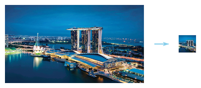
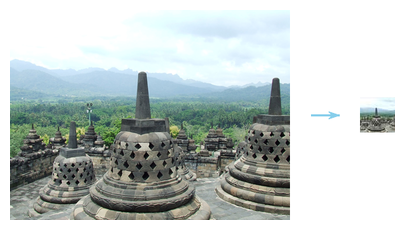
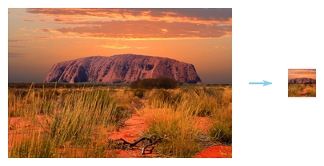

Generating Good Thumbnails
==========================

Here we demonstrate one specific capability of Azure Computer Vision
cognitive service, generating thumbnails from photos, as exposed
through the [MLHub](https://mlhub.ai) package
[azcv](https://github.com/gjwgit/azcv).

Generating a thumbnail from a photo may sound like a pretty simple
task. However, what should go into the thumbnail to give the most
informative indication of the content of the full photo. This is the
task addressed by the thumbnail service as part of the computer vision
cognitive service.

As a command line tool an input image file is supplied and a thumbnail
image file is created with the same name but with -thumbnail appended
to the file name and saved locally.

```console
$ ml thumbnail azcv https://images.pexels.com/photos/338515/pexels-photo-338515.jpeg
pexels-photo-338515-thumbnail.jpeg
```


```console
$ ml thumbnail azcv http://cdn1.thr.com/sites/default/files/2013/11/marina_bay_sands_singapore_a_l.jpg
marina_bay_sands_singapore_a_l-thumbnail.jpg
```


```console
$ ml thumbnail azcv https://access.togaware.com/landmark01.jpg
landmark02-thumbnail.jpg
```



```console
$ ml thumbnail azcv https://www.wayoutback.com.au/assets/Uploads/Uluru.jpg
Uluru-thumbnail.jpg
```
Notice how the whole of Uluru is included in the thumbnail. This
illustrates how the model can identify the best thumbnail tuned to the
main object of the photo.


